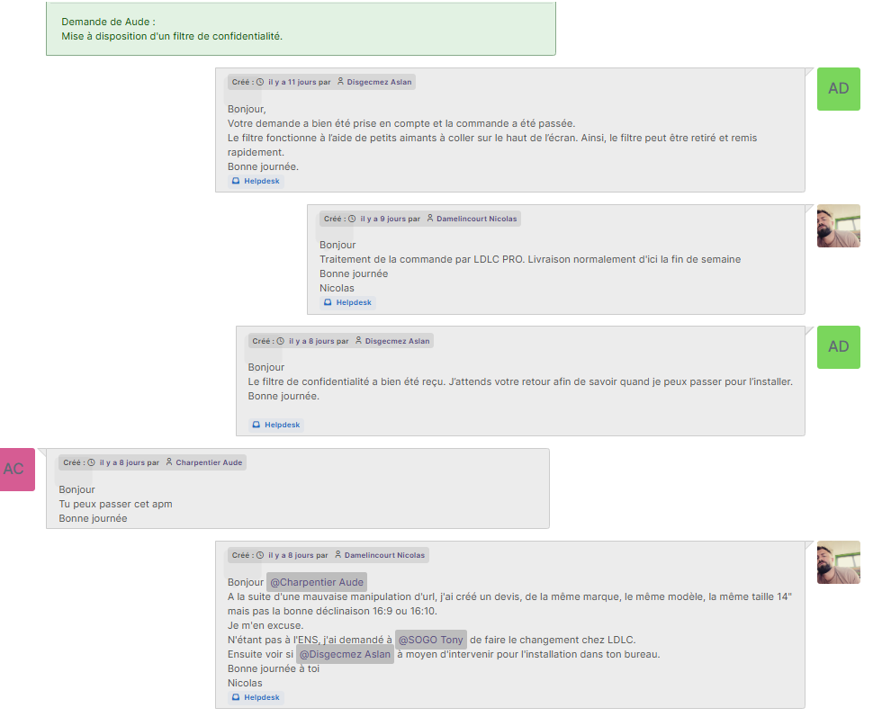
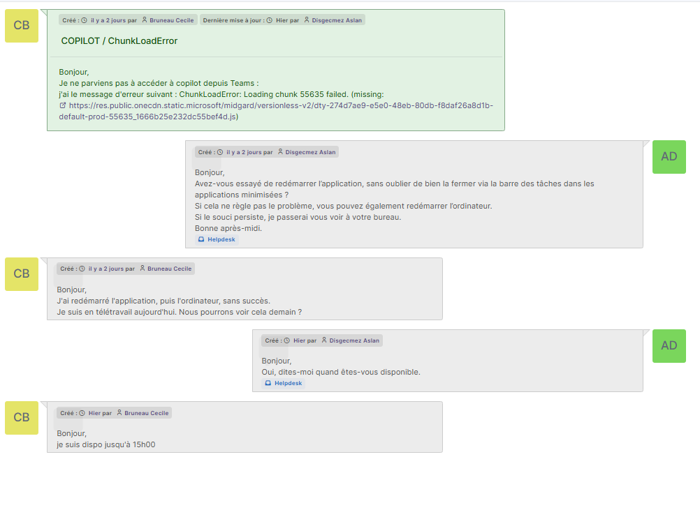
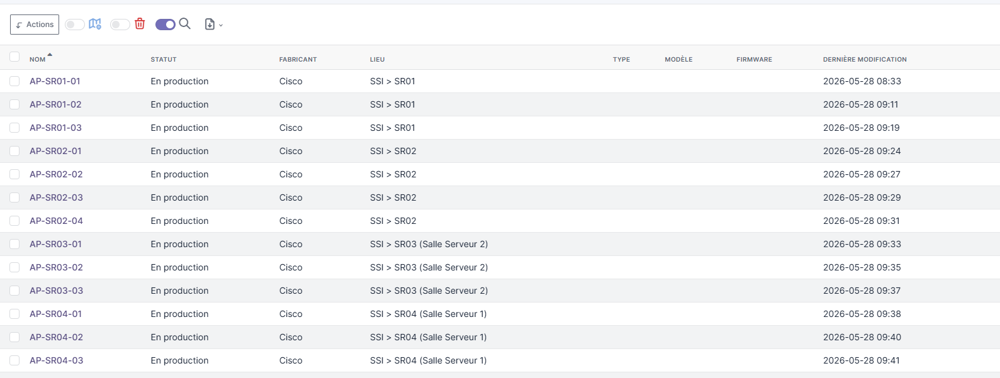
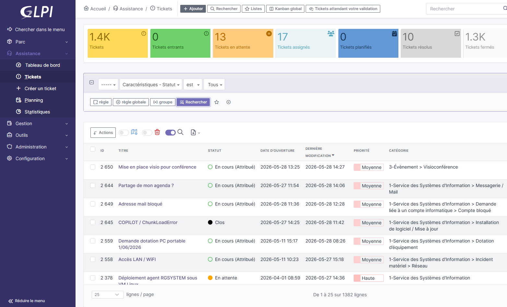

# Compte rendu hebdomadaire - Gestion informatique

## Présentation

Durant cette semaine à l'ENS, les étudiants étant en stage, l'activité
était légèrement ralentie. Ma mission principale a consisté à gérer les
tickets utilisateurs ainsi que l'administration du parc informatique via
GLPI.

Les activités réalisées : - traitement de demandes utilisateurs ; -
gestion du parc informatique ; - résolution d'incidents logiciels ; -
importation et mise à jour des équipements dans GLPI.

------------------------------------------------------------------------

# Gestion des tickets

## Filtre de confidentialité pour la DRH

Une demande a été effectuée par la DRH concernant l'installation d'un
filtre de confidentialité afin de limiter les regards indiscrets lors
des déplacements.

Grâce aux informations présentes dans GLPI, j'ai retrouvé la référence
du poste concerné afin d'identifier le format d'écran nécessaire.

Après recherche auprès du fournisseur LDLC Pro, un filtre adapté a été
commandé puis installé directement sur le poste utilisateur.

------------------------------------------------------------------------

## Résolution d'un problème Copilot dans Microsoft Teams

La responsable du service communication rencontrait un problème avec
Copilot intégré à Teams.

Après analyse, l'origine du problème venait d'un chargement incorrect de
ressources JavaScript.

La résolution a consisté à : - identifier la cause du dysfonctionnement
; - vider le cache Teams via le dossier `%appdata%` ; - relancer
l'application.

Cette intervention a permis de rétablir le fonctionnement normal de
Copilot.

------------------------------------------------------------------------

# Autres interventions

Avec l'équipe informatique, plusieurs interventions ont également été
réalisées :

-   préparation d'une salle de visioconférence pour une présentation du
    parcours CPES ;
-   installation et renouvellement de licences Matlab pour les élèves de
    la section mécatronique ;
-   remise en état d'anciens postes afin de les proposer en prêt.

------------------------------------------------------------------------

# Gestion du parc informatique avec GLPI

Une partie importante de la mission concernait l'administration du parc
informatique.

Actions réalisées : - importation de matériel depuis un fichier Excel
; - centralisation des actifs informatiques ; - mise à jour des
informations équipements.

------------------------------------------------------------------------

# Ajout des bornes Wi-Fi dans GLPI

J'ai participé à l'importation de nouvelles bornes Wi-Fi dans GLPI.

Les informations renseignées comprenaient notamment :

-   nom de l'équipement ;
-   localisation ;
-   technicien responsable ;
-   groupe responsable ;
-   statut ;
-   fabricant Cisco ;
-   numéro de série ;
-   port réseau ;
-   VLAN ;
-   adresse MAC ;
-   adresse IP ;
-   informations fournisseur et garantie.
 
 
------------------------------------------------------------------------

# Compétences développées

Cette semaine m'a permis de développer mes compétences dans :

-   la gestion d'incidents utilisateurs ;
-   l'utilisation de GLPI ;
-   l'administration d'un parc informatique ;
-   le diagnostic logiciel ;
-   la gestion d'équipements réseau ;
-   la documentation technique.
  
